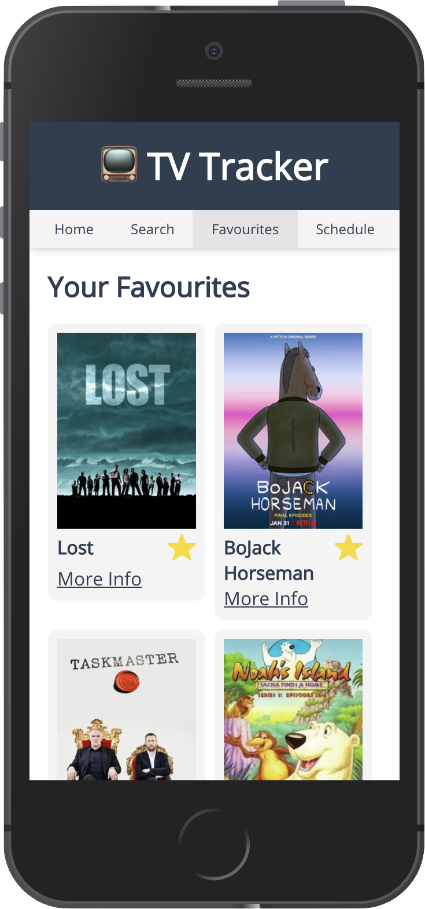

# TV Tracker

## Project setup
Once you have cloned or downloaded the project use terminal to navigate into the project.

### To install, run:
```
npm install
```

### To run the production build, run:
```
npm run build
npm start
```
Then go to `http://localhost:3000`

### To run the development server, run:
```
npm run serve
```
Then go to `http://localhost:8080`

### Other development commands

Use `npm run lint` to lint and fix any styling errors

## What Tools Where Used

### Frontend Framework
The project was built using `Vue` and `Vue CLI`.

`Vue` was used as a compact small frontend web framework and `Vue CLI` was used for initial project setup for easy configuration of some base services like `vue-router`.

### Scripting Languages
`Typescript` was used as the language with `Vue` as I like the class based syntax, added security of type safety and integration with many IDEs auto complete features.

`Javascript` was used for the server as I deemed it unnecessary to add any build complications as the server script is very short and simple.

### State Management
For state management I used `Vuex` with `vuex-persist`. `Vuex` provides a very simple state management pattern designed specifically for `Vue` so it was the most logical choice.

`vuex-persist` was used as the application required persistent storage and it provides an integration between `Vuex` and browser local storage.

### Routing
`vue-router` was used because it is simple and built for `Vue`.

### Server
The very simple server script was built with `express` as it provides a simple, quick and clean way to serve static content that is generated from the build script, and it allows wildcard paths to route to the index page, which means I can let `vue-router` support state replacement/history mode.

### Style Preprocessing
`Sass` with `SCSS` syntax was used for style preprocessing as it offers a simple `css` like syntax with added syntax to make writing styles easier. It also has support of variables meaning certain things such as theme can be set in one place and be used throughout the application.

## The Future
Here are some things that were left out

### Unit tests
I would have liked to create unit tests for each component using `Jest`, to help verify the application is working an for future integration in continuous delivery pipelines.

### Click tests
I would have liked to add end-to-end click tests, perhaps with `Cypress.io`, for the same reasons as unit tests.

### Docker
I would have liked to have created Dockerfile so the application could more easily be ran in development conditions that would closely match the conditions of a production server.

### Browser Testing
I have tested the application in the latest versions of Chrome, Safari and Firefox for MacOS, but would ideally test a far greater variety of browsers, versions and operating systems.

### API Limiting
Because the TV Maze API has a limit of "20 calls every 10 seconds per IP address" I would like to have capped the number of calls I make to this service. The most concurrent calls I make is when display your favourites and your schedule, as individual calls are made for each show.

I could cap the number of favourites a user may have, but I would prefer to have the service that handles requests to this API, keep track of requests and make them wait if the limit is about to be reached. It could also automatically retry and send a stream of results so the user does not need to wait for all the requests to be made before some data can be rendered.
